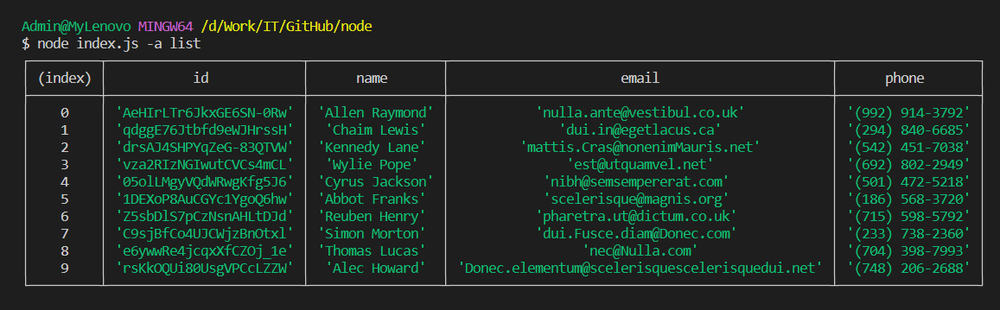
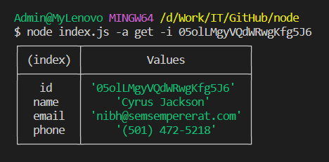
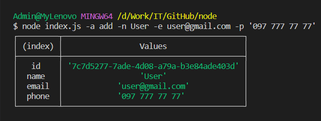
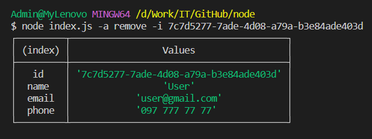

# Домашня робота №1 з курсу Node.js

## Результати роботи проекту

1. Команда отриммання всього список контактів `node index.js --action="list"` або аналогічна команда `node index.js -a list`
   

2. Команда отримання контакту по id `node index.js --action="get" --id 05olLMgyVQdWRwgKfg5J6` або аналогічна команда `node index.js -a get -i 05olLMgyVQdWRwgKfg5J6`
   

3. Команда додавання контакту `node index.js --action="add" --name User --email user@gmail.com --phone "097 777 77 77"` або аналогічна команда `node index.js --action="add" --name User --email user@gmail.com --phone "097 777 77 77"`
   

4. Команда видалення контакту `node index.js --action="remove" --id 7c7d5277-7ade-4d08-a79a-b3e84ade403d` або аналогічна команда `node index.js -a remove -i 7c7d5277-7ade-4d08-a79a-b3e84ade403d`
   
